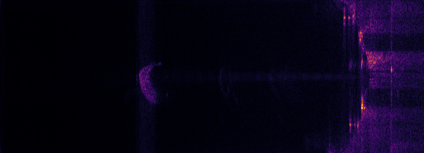

# sonar_image_proc

Code to draw data from forward-looking imaging sonars.

If built for ROS, it will build a node/nodelet
[draw_sonar](https://github.com/apl-ocean-engineering/libdraw_sonar/tree/master/src_ros)
which subscribes to an
[acoustic_msgs/ProjectedSonarImage](https://github.com/apl-ocean-engineering/hydrographic_msgs/blob/main/acoustic_msgs/msg/SonarImage.msg)
and publishes a
[sensor_msgs/Image](https://docs.ros.org/en/melodic/api/sensor_msgs/html/msg/Image.html).

The core library contains no ROS dependencies, and can be linked into non-ROS applications.

# ROS Interfaces (draw_sonar_node)

`rosrun sonar_image_proc draw_sonar_node`

## Subscribers

Subscribes to the topic `sonar_image` of type [acoustic_msgs/ProjectedSonarImage](https://github.com/apl-ocean-engineering/hydrographic_msgs/blob/main/acoustic_msgs/msg/ProjectedSonarImage.msg).


## Publishers

By default publishes three [sensor_msgs/Image](https://docs.ros.org/en/melodic/api/sensor_msgs/html/msg/Image.html) topics:

*  `drawn_sonar` contains an image of the sonar drawn with a cartesian projection
with the origin (range = 0) of the sonar centered on the bottom edge of
the image, and azimuth=0 extending vertically upwards in the image.  By default,
the image height is set by the number range bins, and the image width is
automatically determined based on the height and the min/max azimuth of the
sonar image.   The color map used to convert the sonar intensity to RGB is set
in code.


* `drawn_sonar_rect` is the contents of the SonarImage data mapped directly from polar to cartesian coordinates.
Since the intensity data in the SonarImage is stored azimuth-major, the data is
mapped into the image space with range in the X direction and azimuth in the Y
direction:

 * Image width is the number of range bins in the data, with the minimum range
   on the left side and maximum range on the right side.

 * Image height is the number of azimuth bins in the data, with the lowest
   azimuth (typically the most negative) at the top, and most positive at the
   bottom.



* `drawn_sonar_osd` adds guidelines and annotations to `drawn_sonar`.  Overlay parameters can be configured in realtime.

If the param `publish_timing` is `true`, the node will track the elapsed time to
draw each sonar image and publish that information to the topic `sonar_image_proc_timing`
as a [std_msgs/String](http://docs.ros.org/en/noetic/api/std_msgs/html/msg/String.html)
containing a JSON dict.

If the param `publish_old` is `true`, the node will also draw the sonar using
the old `draw_sonar` algorithm for comparison.

## Params

If `max_range` is set to a non-zero value, images will be clipped/dropped to that max range (or the actual sonar range, whichever is smaller).

If `publish_timing` is `true` the node will publish performance information as a
JSON [string](http://docs.ros.org/en/noetic/api/std_msgs/html/msg/String.html)
to the topic `sonar_image_proc_timing`.  Defaults to `true`

If `publish_old` is `true` the node will also draw the sonar using the old
algorithm to the topic `old_drawn_sonar`.   Defaults to `false`

If `publish_histogram` is `true` the node will publish a "raw" histogram information as a `UInt32MultiArray` to the topic `histogram`.   It contains a vector of unsigned ints giving the count for each intensity value -- so for 8 bit data the vector will be 256 elements in length, and for 16-bit data it will be 65536 elements in length.

# bag2sonar

The program `bag2sonar` reads in a bagfile containing a `ProjectedSonarImage` topic, draws the sonar image and writes those images to *new* bagfile in a `Image` topic.

Usage:

```
$ rosrun sonar_image_proc bag2sonar
Usage:

   bag2sonar [options]  <input file(s)>

Draw sonar from a bagfile:
  -h [ --help ]                         Display this help message
  -l [ --logscale ]                     Do logscale
  --min-db arg (=0)                     Min db
  --max-db arg (=0)                     Max db
  --osd                                 If set, include the on-screen display
                                        in output
  -o [ --output-bag ] arg               Name of output bagfile
  -t [ --output-topic ] arg (=/drawn_sonar)
                                        Topic for images in output bagfile
```

Note that `bag2sonar` is not a conventional ROS node, it is intended to run as a standalone commandline program.  It uses `ros_storage` to read the input bagfile sequentially, rather than subscribing to a topic.

# histogram_drawer

`python/histogram_drawer` is a Python script which subscribes to the `histogram` topic and uses numpy+Matplotlib to bin the data (into a fixed set of 128 bin right now), and draw a plot to the topic `drawn_histogram`.

# Python API

Long term, I'd like to be able to call this drawing function from Python,
however we're not there yet.

# API

Sonar drawing is implemented in the [SonarDrawer](include/sonar_image_proc/SonarDrawer.h) class, which takes an instance of an [AbstractSonarInterface](include/sonar_image_proc/AbstractSonarInterface.h) and returns a cv::Mat.   SonarDrawer computes and stores pre-calculated matrices to accelerate the drawing.

A convenience function [drawSonar](include/sonar_image_proc/DrawSonar.h) is also provided.  It is a trivial wrapper which creates an instance of SonarDrawer then calls it.  Calls to drawSonar do not retain the cached matrices and are less efficient.

# Related Packages

* [liboculus](https://github.com/apl-ocean-engineering/liboculus) provides network IO and data parsing for the Oculus sonar (non-ROS).
* [oculus_sonar_driver](https://gitlab.com/apl-ocean-engineering/oculus_sonar_driver) provides a ROS node for interfacing with the Oculus sonar.
* [acoustic_msgs](https://github.com/apl-ocean-engineering/hydrographic_msgs/tree/main/acoustic_msgs) defines the ROS [ProjectedSonarImage](https://github.com/apl-ocean-engineering/hydrographic_msgs/blob/main/acoustic_msgs/msg/ProjectedSonarImage.msg) message type published by [oculus_sonar_driver](https://gitlab.com/apl-ocean-engineering/oculus_sonar_driver).
* [rqt_sonar_image_view](https://github.com/apl-ocean-engineering/rqt_sonar_image_view) is an Rqt plugin for displaying sonar imagery (uses [sonar_image_proc](https://github.com/apl-ocean-engineering/sonar_image_proc))


# License

Licensed under [BSD 3-clause license](LICENSE).
